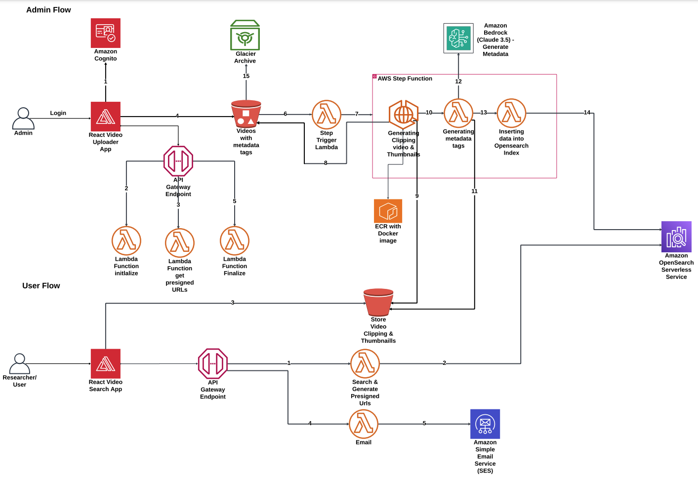

# St. Louis Zoo Video

## Project Overview
The St. Louis Zoo Video Project is a comprehensive cloud-native solution designed to preserve, catalog, and make accessible decades of valuable animal behavior footage. This system enables efficient large video ingestion, manual and intelligent metadata video tagging, and supports advanced search capabilities for researchers and the general public.


## Key Features

<!-- - **Enhanced Large Video Upload Capabilities**: This feature allows for the seamless upload of large video files, supported by comprehensive metadata fields that can be either required or optional, facilitating detailed data organization and accessibility.

- **Automated Video Processing**: Includes features such as video clipping and thumbnail generation to optimize content management.

- **AI-Powered Metadata Extraction**: Utilizes AI to automatically extract critical information like dates and timestamps from videos, enhancing content discoverability and indexing.

- **Advanced Search Functionality**: Empowers users with the ability to filter and retrieve videos based on multiple criteria, ensuring efficient navigation and data retrieval.

- **Preview Clip Generation**: Offers a snapshot of video content through automatically generated preview clips, enabling quick content assessment and selection.

- **Structured Video Access Requests**: Users can formally request access to full videos by submitting a specific form. This process notifies administrators directly, streamlining communication while the approval workflow itself remains outside the project's scope
 -->

- Enhanced Large Video Upload with both required and optional metadata fields.
- Automated video processing (clipping, thumbnail generation)
- AI-powered metadata extraction (date, timestamps)
- Advanced search functionality with multiple filters
- Preview clip for quick content assessment
- Allows users to request full video access, alerting administrators.

<!-- ## Project Goals
- **Ingest and Catalogue Video Footage**: Allow Admin to ingest large video files into the system and catalogue them with appropriate metadata, including tags and timestamps.
- **Enable Smart Search**: Implement a smart search functionality that allows users to easily find videos based on specific behaviors, timestamps, or animal species.
- **Video Previews**: Generate short previews for each video to provide quick glimpses into the content, helping users decide which full videos to retrieve from cold storage. -->


## System Architecture
Refer to the provided diagram for a detailed view of the system architecture, which outlines both the Admin and User Flows. This setup integrates various AWS services to handle video uploads, video metadata tagging, storage, and retrieval processes efficiently.



### Admin Flow
1. **Login**: Admins authenticate through Amazon Cognito to gain system access.
2. **Video Upload**: Admins upload videos via the React Video Uploader App (deployed using AWS cognito).
3. **API Gateway**: Manages the API calls for initiating and finalizing multi-part video uploads.
4. **Video Upload Lambda Functions**:
   - **Initialize**: Triggers when a new upload is started and initialize the multi-part video upload. 
   - **Get Presigned URLs**: Generates individual presigned URLs for each part of the video, facilitating the secure and reliable upload of large video files in parts to S3.
   - **Finalize**: Completes the upload process once all parts of the video have been successfully uploaded. This action consolidates the parts into a single file in S3, making it ready for subsequent processing steps.
5. **Video Processing**:
   - Once videos are uploaded to s3 bucket, the below step function is triggered automatically using a lambda function.
   - **Step Functions**: Orchestrate the video processing tasks.
      - **ECS with Fargate Task**: Executes the processing tasks such as clipping 10 seconds video, thumbnail generation, and metadata extraction.
      - **Lambda Function with Amazon Bedrock (Claude 3.5)**: Generates video date, start time and end time metadata for each video .
      - **Lambda Function for OpenSearch**: Calls the OpenSearch serverless service to store the metadata for each video.
6. **OpenSearch**: Stores all video metadata, enabling efficient and advanced search capabilities.
7. **Glacier Archive**: After processing, videos are archived 2 days after upload date in Glacier for long-term, cost-effective storage.

### User Flow
1. **Search and Filter Videos:** Researchers access a web interface to search for videos using filters like duration, species (scientific/common name), location, group size, and more. Results are displayed, including metadata and links to video clips.

2. **Request Video Access:** Researchers select videos and submit a request for download access. They fill out a form with details such as their name, faculty, and the reason for the request.
3. **Email Notification:** The system sends an email containing the researcher’s request details to an administrator or contact person for review.


## Prerequisites
Before running the AWS CDK stack, ensure the following are installed and configured:

1. **AWS Bedrock Access**: Ensure your AWS account has access to the Claude 3.5 model in Amazon Bedrock.
   - Request access through the AWS console if not already enabled

2. **Download Node.js**: Go to [nodejs.org](https://nodejs.org/) and download the latest LTS (Long-Term Support) version of Node.js for your operating system. This version is recommended because it is more stable and well-tested across multiple platforms.

3. **Install Node.js**: Run the downloaded installer. Follow the installation prompts ensuring that npm is selected to be installed alongside Node.js.

4. **Verify Installation**: After installation, you can verify that Node.js and npm are installed correctly by running the following commands in your terminal:
   ```bash
   node --version
   npm --version
   ```

5. **AWS CLI**: To interact with AWS services and set up credentials.
   - Install and configure [AWS CLI](https://aws.amazon.com/cli/)

6. **AWS CDK**: For defining cloud infrastructure in code.
   - Install and bootstrap [AWS CDK](https://aws.amazon.com/cdk/)

7. **Docker**: Required to build and run Docker images for the ECS tasks while deploying CDK code.
   - Install Docker

8. **AWS Account Permissions**: Ensure your AWS account has the necessary permissions to create and manage the required resources (S3, Lambda, Step Functions, ECS, ECR, CloudWatch, Cognito, Opensearch Serverless, Amplify, SES, etc.)


## Directory Structure

```
├── backendV2 (Backend CDK code for AWS infrastructure and code that handles data processing and storage)
├── frontendV2 (UI React application for the administrative interface to upload and tag videos.)
└── userFlowFrontend (UI React application that allows end users to search and view video previews.)
```

## Setup and Deployment

Clone the project
```
git clone https://github.com/ASUCICREPO/St-Louis-Zoo.git
```

#### This project is divided into three parts: AdminFrontend, UserFlowFrontend and Backend. You can find detailed instructions for each part in their respective README files.

### Backend (backendV2)

The backend codebase facilitates large video uploads and handles video processing tasks such as clipping and thumbnail generation. It leverages AI to extract time and date metadata, storing all results in OpenSearch for efficient and quick data retrieval. Additionally, it contains the infrastructure as code (IaC).

For more information on the backend setup, refer to the [Backend README](./backendV2/README.md).


### Admin Frontend Application (frontendV2)

The frontend provides a user-friendly interface for large video uploads and selecting associated metadata. Built using React, it connects with the backend via API calls to manage video processing tasks efficiently

For more information on the backend setup, refer to the [AdminFrontend README](./frontendV2/README.md).

### UserFlow Frontend Application

<!-- ## Getting Started
1. **Setting Up the Backend**:
   Follow the setup instructions to configure AWS services and deploy the backend components.
2. **Running the Frontend**:
   Instructions for installing dependencies and running the React application locally. -->

## Adding an Admin to AWS Cognito User Pool

### 1. Log in to AWS Management Console
Access the [AWS Management Console](https://aws.amazon.com/console/) and sign in with your credentials.

### 2. Access Cognito
- In the AWS Management Console's search bar at the top, type `Cognito`.
- Select **Amazon Cognito** from the dropdown menu to open the Cognito dashboard.

### 3. Select Your User Pool
- On the Amazon Cognito dashboard, you will see two options: **User Pools** and **Identity Pools**.
- Click on **User Pools**.
- Choose the user pool **ZooAdminUserPool**

### 4. Manage Users
- To add a new user, click **Create user**.
  - Ensure that for field "Alias attributes used to sign in"
  **Email** is selected
  - Fill in the required fields such as username, email (as required by your user pool settings), and password.
  - Ensure to set the **Mark email as verified** if email is a required attribute.
  - Click **Create user**.

### 5. Using the Admin Credentials
- With the admin user successfully created, you can now use these credentials to log in to the St. Louis Zoo Admin flow.
- Navigate to the login page of the St. Louis Zoo Admin portal and enter the admin username and password you set up.
- Upon successful authentication, you will have access to admin functionalities.


## S3 Lifecycle Management for Video Storage

### Overview

For the St. Louis Zoo project, we have implemented an S3 lifecycle policy to efficiently manage video storage costs and ensure long-term durability. Videos uploaded to the S3 bucket are automatically transitioned to Glacier Deep Archive for cost-effective storage.

 


### Lifecycle Rule Details

- **Rule Application**: The lifecycle rule applies to all uploaded video files stored in the S3 bucket designated for the zoo's surveillance footage.
- **Transition to Glacier Deep Archive**: Uploaded videos are moved to Glacier Deep Archive 2 days after their upload date. This transition allows us to benefit from the lower storage costs associated with Glacier Deep Archive while keeping the videos accessible for future retrieval if needed.

### Exclusions from Archiving

- **Clips and Thumbnails**: To ensure quick access and usability, short clips and thumbnails extracted from the original videos are **not** archived. These derivatives are stored in standard S3 storage to facilitate immediate access and use in user search


## Usage
Once Infastructure (backend) and FrontEnd's are deployed:  
<!-- - **Admin Flow**: Admins can upload large videos with metadata information, which are then processed to extract previews and metadata before being archived. -->
#### Admin Flow
- **Bulk Upload**: Admin can upload up to 20 large video files simultaneously.

- **Batch Tagging**: All videos uploaded in a single batch are tagged with the same set of metadata/tags.
  - **Required Metadata/Tags**: It is mandatory for Admin to provide specific metadata/tags that are crucial for the categorization and retrieval of the videos.
  - **Optional Metadata/Tags**: Admin can additionally provide optional metadata/tags to enrich the video data further.

#### User Flow

- **User Flow**: Users can search the video catalog using the smart search feature, view video previews, and retrieve metadata.

<!-- ## Future Enhancements
- Enhancing the video processing capabilities to include AI-based tagging for more precise metadata generation.
- Implementing more granular access controls for different user roles within the system. -->

## 📝 Pro Tip:

Make sure to deploy the backend before working on the frontend! 🛠️ This ensures that all the API endpoints , Lambda functions and all required Services are live and ready for your frontend to interact with.


## Contributing

Contributions to this project are welcome. Please fork the repository and submit a pull request with your changes
